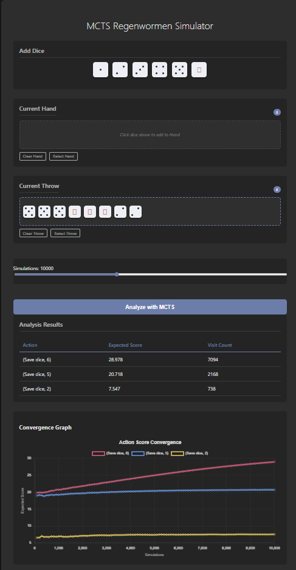

# MCTS Regenwormen

A web-based implementation of the "Regenwormen" (Pickomino) dice game, featuring a powerful AI opponent powered by Monte Carlo Tree Search (MCTS).



## Features

- **Interactive UI**: Play the game using a modern, dark-themed web interface with clickable 3D dice.
- **Smart AI**: Analyze moves using a Monte Carlo Tree Search (MCTS) backend that suggests the best actions.
- **Data Visualization**: Real-time convergence graphs showing how the AI evaluates different moves.
- **Parallelized Performance**: Optimized simulation engine capable of running thousands of simulations per second.

## Getting Started

### Prerequisites
- Docker & Docker Compose
- *Or* Python 3.12+ (for local backend development)

### Quick Start (Docker)

To start the full application (frontend + backend):

```bash
docker-compose up -d --build
```

The application will be available at:
- Frontend: `http://localhost:80` (or configured port)
- Backend API: `http://localhost:8000`

## Development

The project is structured into two main components:

- **`frontend/`**: The web interface (HTML/CSS/JS).
- **`backend/`**: The Python FastAPI application and MCTS logic.

### Backend Setup (Local)
Dependencies are managed with `uv`.

```bash
cd backend
uv sync
uv run main.py
```

## AI Implementation

The core of this project is the **Monte Carlo Tree Search (MCTS)** algorithm located in `backend/src/tree.py`.

### Known Limitations

#### Stochasticity & Convergence
You may observe that the expected score for certain actions (e.g., `(Save dice, 6)`) climbs continuously instead of stabilizing.

- **Observation**: The expected value keeps increasing as simulations run.
- **Cause**: The current MCTS implementation caches the result of the stochastic `ROLL` action after the first visit. Effectively, the AI "freezes" the dice outcomes for that branch and solves the now-deterministic future perfectly.
- **Implication**: The AI optimizes for a specific "lucky" (or unlucky) future rather than the true average.
- **Future Roadmap**: We plan to implement **Open Loop MCTS** or **Chance Nodes** to correctly model the probabilistic nature of the dice rolls.

## License

[MIT](LICENSE)
